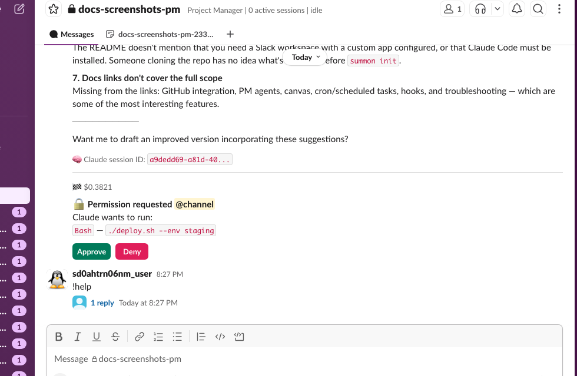
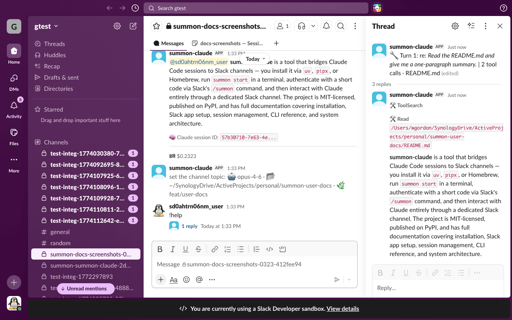
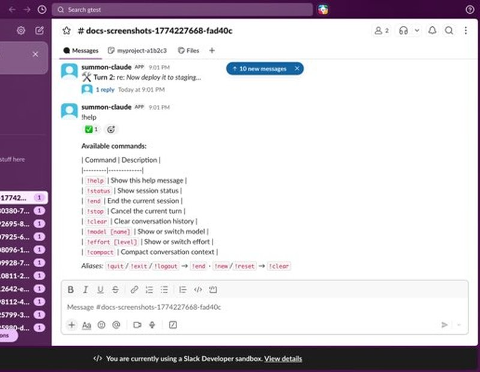

# Quick Start

This walkthrough covers your first summon-claude session from terminal to Slack.

## Prerequisites

- summon-claude [installed](installation.md)
- [Slack app configured](slack-setup.md) and `summon config check` passing

---

## Step 1: Start a session

In your terminal, navigate to your project directory and run:

```bash
summon start
```

summon-claude launches a Claude Code session in the background and prints an authentication code:

``` { .text .annotate }
Session started. Authenticate in Slack with:
  /summon ABC123  # (1)

Waiting for authentication... # (2)
```

1. This is a one-time code that expires in 5 minutes. Type it exactly as shown in any Slack channel.
2. The daemon runs in the background. You can close this terminal after authenticating.

<!-- TODO: add quickstart-terminal-start.png screenshot -->

!!! note "Background process"
    The session runs as a background daemon. You can close this terminal window after authenticating — Claude keeps running.

---

## Step 2: Authenticate in Slack

Open Slack, go to any channel where you want the session to live, and type:

```
/summon ABC123
```

Use the exact code from your terminal. The session binds to that channel.



!!! tip "Choose your channel"
    Each session gets its own dedicated channel. You can use an existing channel or create one specifically for this session. All of Claude's responses will appear there.

---

## Step 3: Send your first message

Once authenticated, summon-claude posts a welcome message in the channel. You can now send messages directly in the channel:

```
Hello! What can you help me with today?
```



---

## Understanding the emoji lifecycle

summon-claude uses emoji reactions to show what Claude is doing:

| Emoji | Meaning |
|-------|---------|
| :inbox_tray: | Message received, Claude is thinking |
| :gear: | Claude is actively working (running tools) |
| :white_check_mark: | Turn completed successfully |
| :warning: | Turn ended with an error |

---

## Step 4: Review tool permissions

When Claude wants to use a tool (run a command, read a file, etc.), summon-claude posts a message with Approve/Deny buttons:


Click **Approve** to let Claude proceed, or **Deny** to reject the action. Claude adapts its approach based on your decision.

---

## Step 5: Explore available commands

Type `!help` in the Slack channel to see all available in-channel commands:

```
!help
```



Common commands:

| Command | Description |
|---------|-------------|
| `!help` | List all available commands |
| `!status` | Show session status and context usage |
| `!end` | End the session gracefully |
| `!stop` | Stop immediately (same as `summon stop`) |

---

## Step 6: End the session

When you're done, end the session from Slack:

```
!end
```

Or from the terminal:

```bash
summon stop
```

Either method terminates the Claude session and posts a summary in the channel.

---

## What's next

- [User Guide: Sessions](../guide/sessions.md) — session lifecycle, naming, and management
- [User Guide: Commands](../guide/commands.md) — full command reference for in-channel interaction
- [User Guide: Permissions](../guide/permissions.md) — how tool permission handling works
- [User Guide: Configuration](../guide/configuration.md) — customize summon-claude behavior
