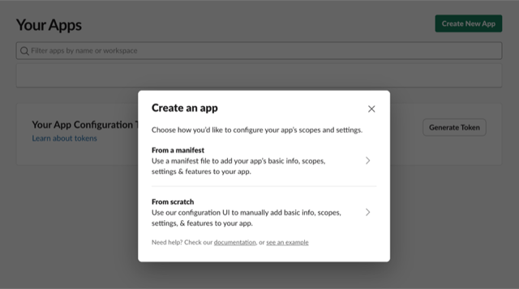
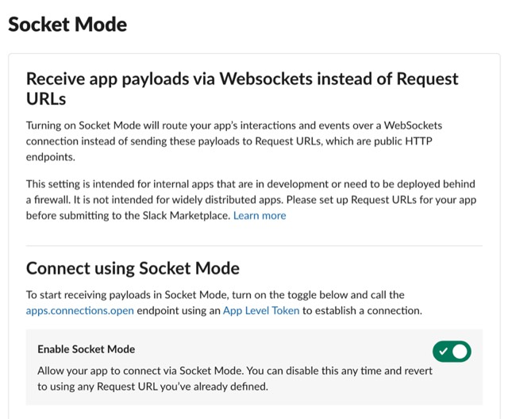
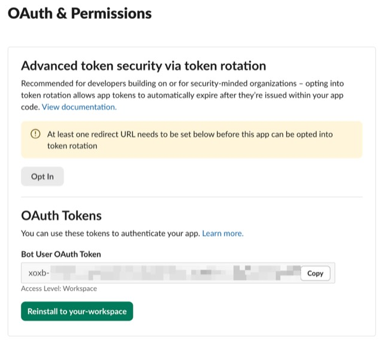

# Slack Setup

Before starting your first session, you need to create a Slack app and configure summon-claude with its credentials.

## Prerequisites

- Slack workspace where you have **admin access** (or can request admin approval)
- The summon-claude app manifest from the repository

---

## Step 1: Create the Slack app

1. Go to [api.slack.com/apps](https://api.slack.com/apps) and click **Create New App**
2. Choose **From a manifest**
3. Select the workspace where you want to install summon-claude
4. Paste the contents of [`slack-app-manifest.yaml`](https://github.com/summon-claude/summon-claude/blob/main/slack-app-manifest.yaml) from the repository
5. Click **Create** and then **Install to Workspace**



!!! tip "Using the manifest"
    The manifest pre-configures all required scopes, event subscriptions, and Socket Mode settings. Do not create the app manually — the manifest ensures nothing is missed.

---

## Step 2: Enable Socket Mode

In your app settings, go to **Settings > Socket Mode** and toggle it on. Generate an **App-Level Token** with the `connections:write` scope.



!!! warning "Socket Mode is required"
    summon-claude uses Socket Mode (WebSocket) for real-time event delivery. Without it, the app will not receive messages from Slack.

---

## Step 3: Collect your credentials

You need three values from the Slack app settings:

| Credential | Where to find it | Format |
|------------|-----------------|--------|
| Bot Token | **OAuth & Permissions > Bot User OAuth Token** | `xoxb-...` |
| App Token | **Settings > Basic Information > App-Level Tokens** | `xapp-...` |
| Signing Secret | **Settings > Basic Information > App Credentials** | 32-character hex string |



---

## Step 4: Run the setup wizard

summon-claude includes an interactive setup wizard:

```bash
summon init
```

The wizard prompts for your Bot Token, App Token, and Signing Secret, then writes them to the summon-claude config file.


---

## Step 5: Validate the configuration

```bash
summon config check
```

This verifies that all credentials are present and that summon-claude can connect to Slack.

---

## Common setup errors

**Wrong scopes**
: If you created the app manually instead of from the manifest, required scopes may be missing. Check **OAuth & Permissions > Bot Token Scopes** and compare against the manifest.

**Missing App-Level Token**
: The App Token (`xapp-`) is separate from the Bot Token (`xoxb-`). If you skipped Socket Mode setup, the App Token will not exist.

**Socket Mode not enabled**
: `summon config check` will report a connection failure if Socket Mode is off. Toggle it on at **Settings > Socket Mode**.

**Not installed to workspace**
: After creating the app from the manifest, you must click **Install to Workspace** to generate the Bot Token. Without installation, no token exists.

---

## Next steps

With Slack configured, you're ready to start your first session:

[Quick Start](quickstart.md){ .md-button .md-button--primary }
