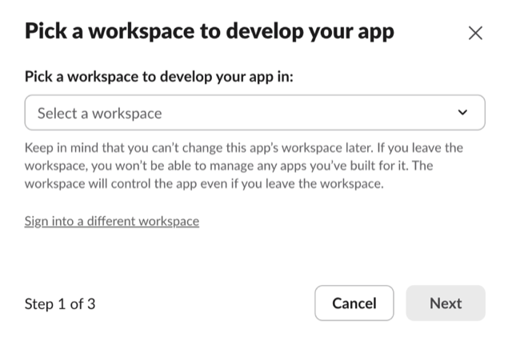
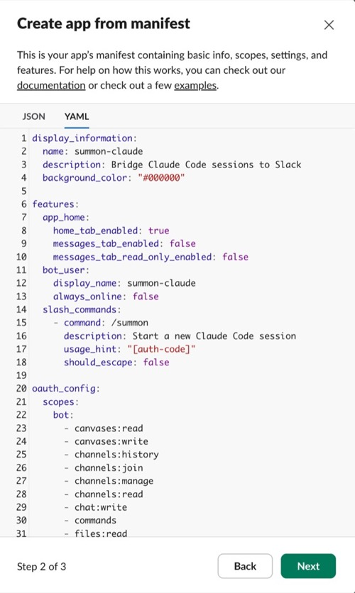
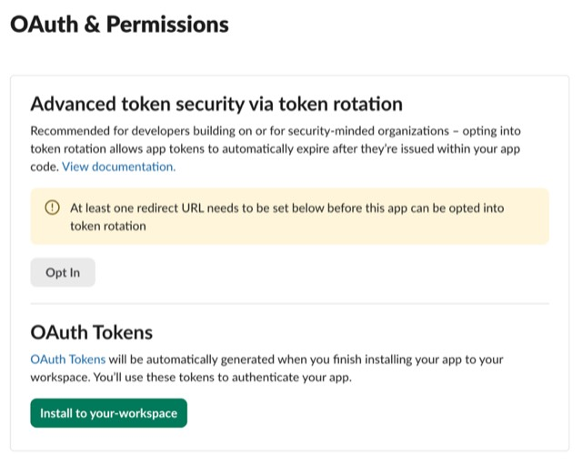
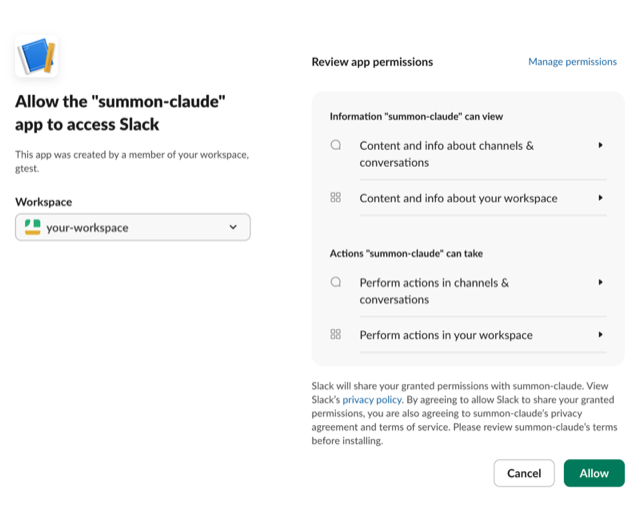
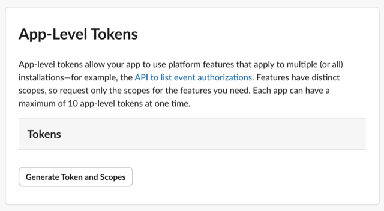
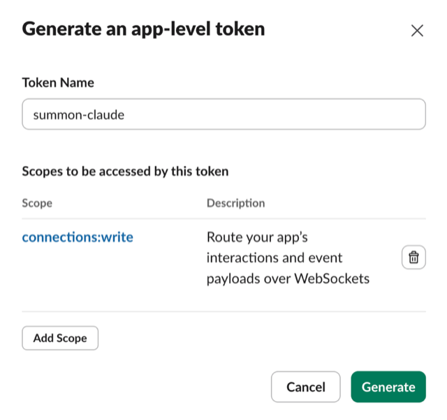
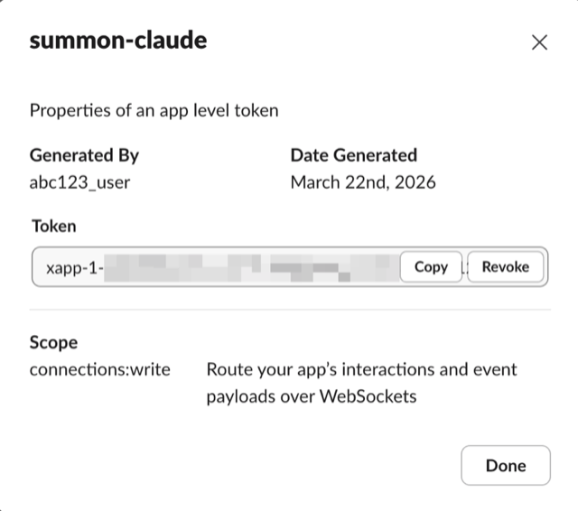

# Slack Setup

Before starting your first session, you need to create a Slack app and configure summon-claude with its credentials.

## Prerequisites

- Slack workspace where you have **admin access** (or can request admin approval)
- The summon-claude app manifest from the repository

---

## Step 1: Create the Slack app

1. Go to [api.slack.com/apps](https://api.slack.com/apps) and click **Create New App**

    

2. Choose **From a manifest**

3. Select the workspace where you want to install summon-claude

    

4. Select the **YAML** tab (Slack defaults to JSON), then paste the contents of [`slack-app-manifest.yaml`](https://github.com/summon-claude/summon-claude/blob/main/slack-app-manifest.yaml) from the repository

    

5. Click **Next** to see Slack's review screen. Verify:
    - App name is **summon-claude**
    - Scopes include `channels:manage`, `chat:write`, `reactions:write`, and others
    - Features show Socket Mode enabled

    Then click **Create**

!!! tip "Using the manifest"
    The manifest pre-configures all required scopes, event subscriptions, and Socket Mode settings. Do not create the app manually — the manifest ensures nothing is missed.

---

## Step 2: Install to your workspace

After creating the app, install it to your workspace:

1. Go to **OAuth & Permissions** and click **Install to Workspace**

    

2. Review the permissions and click **Allow**

    

---

## Step 3: Verify Socket Mode is enabled

The app manifest sets `socket_mode_enabled: true`, so Socket Mode should already be on. To confirm, go to **Settings > Socket Mode** in your app settings and verify the toggle is enabled.

!!! warning "Socket Mode is required"
    summon-claude uses Socket Mode (WebSocket) for real-time event delivery. Without it, the app will not receive messages from Slack. If the toggle is off, enable it manually — this can happen if the app was created without the manifest or if the setting was changed after creation.

---

## Step 4: Generate an App-Level Token

1. Go to **Settings > Basic Information > App-Level Tokens**

    

2. Click **Generate Token and Scopes**, name it `summon-claude`, and add the `connections:write` scope

    

3. Click **Generate** and copy the token (starts with `xapp-`)

    

---

## Step 5: Collect your credentials

You need three values from the Slack app settings:

| Credential | Where to find it | Format |
|------------|-----------------|--------|
| Bot Token | **OAuth & Permissions > Bot User OAuth Token** | `xoxb-...` |
| App Token | **Settings > Basic Information > App-Level Tokens** | `xapp-...` |
| Signing Secret | **Settings > Basic Information > App Credentials** | 32-character hex string |

---

## Step 6: Configure summon-claude

With your credentials collected, proceed to the [Configuration](configuration.md) page to run the setup wizard and verify your installation.

---

## Common setup errors

**Wrong scopes**
: If you created the app manually instead of from the manifest, required scopes may be missing. Check **OAuth & Permissions > Bot Token Scopes** and compare against the manifest.

**Missing App-Level Token**
: The App Token (`xapp-`) is separate from the Bot Token (`xoxb-`). If you skipped Socket Mode setup or the App-Level Token generation, it will not exist.

**Socket Mode not enabled**
: `summon config check` will report a connection failure if Socket Mode is off. Toggle it on at **Settings > Socket Mode**.

**`connections:write` scope missing**
: The App-Level Token must have the `connections:write` scope. If you generated a token without this scope, delete it and generate a new one.

**Not installed to workspace**
: After creating the app from the manifest, you must click **Install to Workspace** to generate the Bot Token. Without installation, no token exists.

---

## Next steps

With your Slack app created and credentials collected, configure summon-claude:

[Configuration](configuration.md){ .md-button .md-button--primary }
