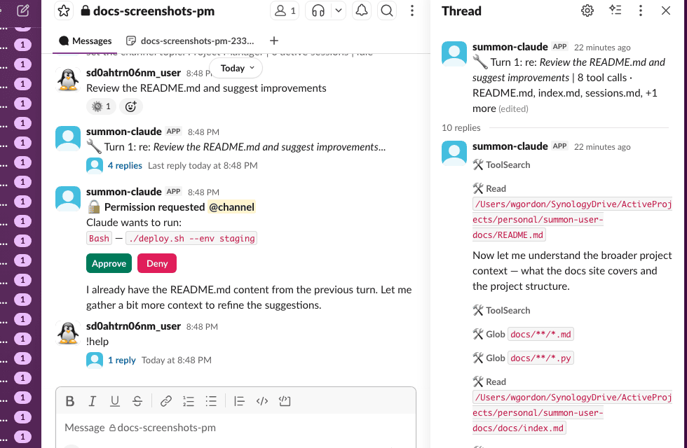

# Permission Handling

When Claude wants to run a tool that could modify files, execute commands, or take other consequential actions, summon pauses and asks for your approval in Slack. This keeps you in control without interrupting every read operation.



---

## Auto-approved tools

The following tools are always approved without prompting. They are read-only and cannot modify your system:

| Tool | Description |
|------|-------------|
| `Read` / `Cat` | Read file contents |
| `Grep` | Search file contents |
| `Glob` | List files by pattern |
| `WebSearch` | Search the web |
| `WebFetch` | Fetch a URL |
| `LSP` | Language server protocol queries |
| `ListFiles` | List directory contents |
| `GetSymbolsOverview` | Read code symbols overview |
| `FindSymbol` | Find a symbol definition |
| `FindReferencingSymbols` | Find symbol references |

All other tools — write operations (`Bash`, `Edit`, `Write`, `NotebookEdit`), network operations that send data, and any unknown tool — require Slack approval.

---

## Approval flow

When Claude requests a tool that needs approval:

1. **Ping in the main channel** — summon posts `@you Permission needed` to notify you.
2. **Ephemeral approval message** — an interactive message appears, visible only to you, describing what Claude wants to do.
3. **You click Approve or Deny** — the ephemeral message disappears and a persistent confirmation is posted in the turn thread.
4. **Claude continues** — if approved, Claude runs the tool; if denied, Claude is told the action was denied and adapts.

```
Claude wants to run:
`Bash`: `npm run build`

[Approve]  [Deny]
```

### Batched requests

If Claude requests multiple tools within a 500ms window (configurable via `SUMMON_PERMISSION_DEBOUNCE_MS`), they are batched into a single approval message:

```
Claude wants to perform 3 actions:
1. `Edit`: `src/auth/login.py`
2. `Write`: `src/auth/token.py`
3. `Bash`: `python -m pytest tests/test_auth.py`

[Approve]  [Deny]
```

Approve or Deny applies to all tools in the batch.

!!! tip "Debounce tuning"
    The default 500ms window catches most batches naturally. Lower it (e.g. `SUMMON_PERMISSION_DEBOUNCE_MS=200`) to reduce latency, or set it to `0` to get a separate message per tool.

---

## Timeout

Permission requests expire after **5 minutes**. If you do not respond:

- The request is automatically denied.
- A timeout message is posted in the turn thread.
- Claude is told the permission timed out and adapts (typically by reporting it could not complete the action).

---

## GitHub MCP permissions

When `SUMMON_GITHUB_PAT` is configured, Claude has access to GitHub tools via the remote MCP server. These follow separate permission tiers:

**Auto-approved (read-only):** Any tool with a `get_`, `list_`, or `search_` prefix, plus `pull_request_read` and `get_file_contents`.

**Always require Slack approval** — checked before prefix rules, so no `allowedTools` pattern can bypass them:

| Tool | Reason |
|------|--------|
| `merge_pull_request` | Irreversible |
| `delete_branch` | Irreversible |
| `close_pull_request` | Visible to others |
| `close_issue` | Visible to others |
| `push_files` | Writes to remote |
| `create_or_update_file` | Writes to remote |
| `update_pull_request_branch` | Modifies shared branch |
| `pull_request_review_write` | Visible to others |
| `create_pull_request` | Visible to others |
| `create_issue` | Visible to others |
| `add_issue_comment` | Visible to others |

Any GitHub MCP tool not on either list also requires Slack approval (fail-closed).

!!! warning "Defense in depth"
    The require-approval list is checked before prefix-based auto-approve. Even if your `~/.claude/settings.json` has a broad `allowedTools` pattern that would normally permit these tools, summon still routes them to Slack for approval.

---

## AskUserQuestion

Claude can ask you structured questions mid-task using the `AskUserQuestion` tool. This appears as an ephemeral interactive message:

```
Claude has a question for you

Which database should I use for the session store?
  [SQLite]  [PostgreSQL]  [Redis]  [Other]
```

- **Single-select:** click a button to answer and continue.
- **Multi-select:** toggle options, then click **Done**.
- **Other:** click **Other** to type a free-text answer in the channel.

Your answers are returned to Claude as structured data. The question times out after 5 minutes if unanswered.

---

## Authorization scope

Only the authenticated user for a session can approve or deny permission requests. The authenticated user is the person who claimed the session with `/summon CODE` in Slack.

If a different user clicks the approval buttons, the action is ignored with a warning logged. This prevents other workspace members from approving actions on your behalf.
